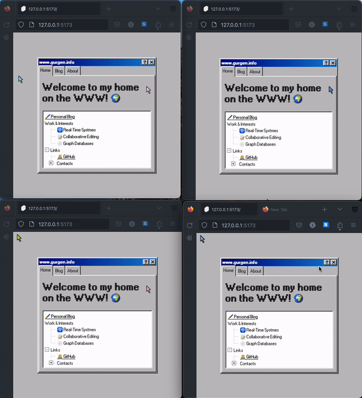

# Window 98 Style Personal Website With Real-Time Updates



## The Good Parts

- Real-Time communication is handled using the awesome [PartyKit](https://partykit.io), the whole backend fits in here: `src/lib/partykit.server.ts`
- The retro windows 98-like look is made using [98.css](https://jdan.github.io/98.css)
- Real-Time cursor updates:
  - To not be a burden on the network, I throttle the `mousemove` event broadcasting.
  - This results in a very laggy cursor position rendering on other clients.
  - To fix it, I used [Svelte's](https://svelte.dev) `Tweened` stores, but since my state is not a primitive, but a Map, I had to write a custom `interpolate` function that would modify the position updates smoothly over specified duration(check it here: `src/lib/utils/motion.ts`)

## Running The Project

To run the project you need to run a local instance of our `partykit` server and run the Svelte app in development mode.

```bash
git clone https://github.com/rasjonell/realtime-retro

cd realtime-retro

npm install

npx partykit dev src/lib/partykit/index.server.ts
```

Then separately run the Svelte app:

```bash
npm run dev -- --open
```

## Building

To create a production version of our app:

```bash
npm run build
```

Copy `.env.example` to `.env` and update it according to your configs

To deploy a production version of our `partykit` server:

```bash
npx partykit deploy src/lib/partykit/index.server.ts --name <your-server-name>
```

You can preview the production build with `npm run preview`.
